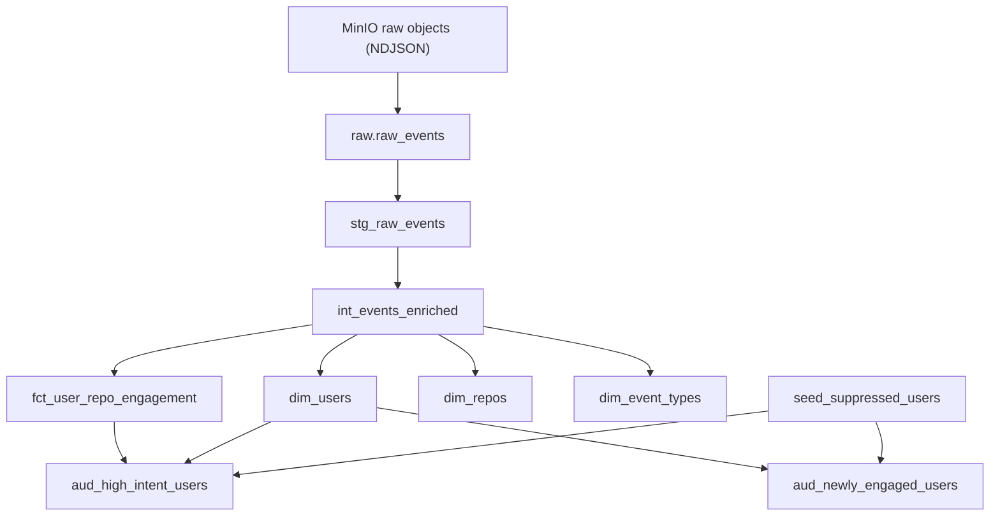

# Data Flow, Tables, and Environment Variables

This document describes all data tables involved in the project, how data flows between them, and which environment variables control pipeline behavior.

## 1) End-to-end flow

```text
GitHub Org Events API
  -> dl-ingestion
  -> MinIO raw objects (NDJSON)
  -> dwh-loader
  -> raw.raw_events (PostgreSQL)
  -> dbt (staging -> intermediate -> marts)
  -> analytics-ready dimensions, fact, and audience tables
```

## 2) Tables and model artifacts involved

### Raw layer (loaded by dwh-loader)
- `raw.raw_events`

### dbt output schema
All dbt models are created in the `github_engagement_analytics` schema by default.

### dbt staging/intermediate models
- `stg_raw_events`
- `int_events_enriched`

### dbt mart models
- `dim_users`
- `dim_repos`
- `dim_event_types`
- `fct_user_repo_engagement`
- `aud_high_intent_users`
- `aud_newly_engaged_users`

### dbt seed
- `seed_suppressed_users` — static list of users (e.g. bots, service accounts) excluded from all audience outputs; joined in both `aud_high_intent_users` and `aud_newly_engaged_users` to filter suppressed users before final output

## 3) Table-level lineage



## 4) Environment variables by component

### A) `dl-ingestion` controls
- `LOG_LEVEL`
- `GITHUB_ORG`
- `GITHUB_TOKEN`
- `RAW_BUCKET`
- `RAW_PREFIX`
- `OPERATIONAL_BUCKET`
- `CHECKPOINT_KEY`
- `MINIO_ENDPOINT`
- `MINIO_ACCESS_KEY`
- `MINIO_SECRET_KEY`
- `GITHUB_REQUEST_TIMEOUT_SECONDS`

Purpose:
- Controls GitHub extraction scope, MinIO location, checkpointing, and request/runtime behavior.

### B) `dwh-loader` controls
- `LOG_LEVEL`
- `GITHUB_ORG`
- `RAW_BUCKET`
- `RAW_PREFIX`
- `OPERATIONAL_BUCKET`
- `CHECKPOINT_KEY`
- `MINIO_ENDPOINT`
- `MINIO_ACCESS_KEY`
- `MINIO_SECRET_KEY`
- `POSTGRES_HOST`
- `POSTGRES_PORT`
- `POSTGRES_DB`
- `POSTGRES_USER`
- `POSTGRES_PASSWORD`

Purpose:
- Controls raw file discovery in MinIO, checkpointing, and PostgreSQL load target.

### C) `data-modeling` (dbt) controls
Connection/runtime:
- `POSTGRES_HOST`
- `DEFAULT_POSTGRES_HOST`
- `POSTGRES_PORT`
- `POSTGRES_DB`
- `POSTGRES_USER`
- `POSTGRES_PASSWORD`

Model behavior (`dbt --vars` via shell script):
- `DBT_AUDIENCE_WINDOW_DAYS` — lookback window in days for audience qualification; used by `aud_high_intent_users` (default: 30)
- `DBT_HIGH_INTENT_SCORE_THRESHOLD` — minimum total engagement score for a user to qualify as high intent (default: 10)
- `DBT_HIGH_INTENT_MEANINGFUL_THRESHOLD` — minimum number of meaningful events for high-intent qualification (default: 5)
- `DBT_NEWLY_ENGAGED_WINDOW_DAYS` — lookback window in days for first-event recency; used by `aud_newly_engaged_users` (default: 14)
- `DBT_INCREMENTAL_BACKFILL_DAYS` — overlap window in days added to incremental loads to prevent missing events at load boundaries (default: 1)

Purpose:
- Controls dbt connection target and business thresholds/windows for incremental and audience logic.

