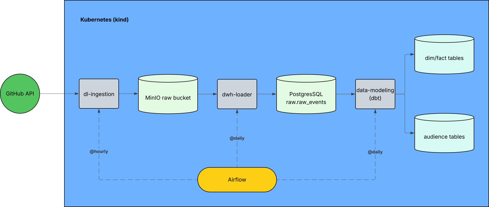

# Design Doc: MarTech Data Platform

## 1. Overview

This project implements a small end-to-end MarTech data platform for GitHub engagement analytics and audience creation. The pipeline ingests raw events from Adevinta's GitHub organization, stores them in object storage, loads them into a warehouse, and transforms them into analytics-ready dimensional, fact, and audience tables.

The design is intentionally modular so that ingestion, warehouse loading, and transformation can run independently, scale independently, and be orchestrated independently.

## 2. Architecture Summary

Project repository and container images: https://github.com/prabhusathy2008/martech-data-platform

At a high level, the platform follows this flow:

1. `dl-ingestion` extracts GitHub events from the public API.
2. Raw events are written to the MinIO `dl-raw-events` bucket in raw NDJSON format.
3. `dwh-loader` reads those raw files and loads them into PostgreSQL.
4. `data-modeling` runs dbt models to build staging, intermediate, mart, and audience outputs.
5. Airflow orchestrates the modules as separate DAGs.

## 3. Source System

The source system is the GitHub Public API for events from the Adevinta GitHub organization.

Source details:

- Endpoint reference: https://docs.github.com/en/rest/activity/events?apiVersion=2026-03-10
- Source organization: https://github.com/adevinta

## 4. Application Modules

The application is split into three modules.

### 4.1 `dl-ingestion`

Purpose:
- Pull raw event data from the GitHub API.
- Land it in MinIO without transforming the source payload.

Behavior:
- Writes raw files to the `dl-raw-events` bucket.
- Uses checkpointing to support incremental progress.
- Intended production cadence: hourly.
- No authentication is required for the demo path.
- A token can still be provided, and the ingestion code supports that option.

Ingestion strategy:
- The GitHub events API only returns the most recent 300 events.
- Because event traffic can be high, `dl-ingestion` is designed to run hourly in production.
- The ingestion job stores source data in raw NDJSON files partitioned by year/month/day/hour.
- This partitioning keeps the landing zone simple, supports replay by time window, and reduces downstream scan size.

Why hourly:
- The source API exposes only a limited recent-event window.
- Frequent ingestion reduces the risk of missing high-volume events.

### 4.2 `dwh-loader`

Purpose:
- Move landed raw files from MinIO into PostgreSQL.

Behavior:
- Reads from the raw object storage bucket.
- Loads events into the warehouse raw layer.
- Uses checkpointing to avoid reprocessing the same raw slices.
- Intended production cadence: daily.

### 4.3 `data-modeling`

Purpose:
- Transform raw warehouse data into analytics-ready models and audience outputs.

Behavior:
- Runs dbt models over PostgreSQL.
- Builds dimension, fact, and audience tables.
- Intended production cadence: daily.

For module-level data flow and environment-variable controls, see [docs/data-flow-and-env-vars.md](data-flow-and-env-vars.md).

## 5. Storage and Incremental State

The platform uses MinIO for object storage and PostgreSQL for warehouse storage.

### MinIO buckets

- `dl-raw-events`: stores landed raw event files.
- Raw object prefix: `source=github/org=adevinta/`.
- `ops-pipelines`: stores pipeline checkpoints used by both `dl-ingestion` and `dwh-loader`.
- Checkpoint keys:
   - `dl-ingestion/events/github/adevinta/checkpoint.json`
   - `dwh-loader/events/github/adevinta/checkpoint.json`

Using a shared operational checkpoint bucket gives both upstream modules a lightweight mechanism to guarantee incremental progress across reruns.

### PostgreSQL

PostgreSQL stores the raw event table and the downstream dbt models. The raw warehouse layer is the handoff point between extraction/loading and analytics transformation.

## 6. Data Modeling Design

The transformation layer is implemented with dbt and uses three logical layers:

### Staging

- Cleans and standardizes raw event fields.
- Represents source-aligned records in a more queryable structure.
- Uses incremental loading.

### Intermediate

- Applies business-ready transformations and enrichment.
- Prepares reusable datasets for marts.
- Uses incremental loading.

### Marts

- Builds final analytical outputs for downstream use.
- Includes dimensions, facts, and audience tables.

Representative outputs include:

- `dim_users`
- `dim_repos`
- `dim_event_types`
- `fct_user_repo_engagement`
- `aud_high_intent_users`
- `aud_newly_engaged_users`

For full table lineage and environment-variable mapping, see [docs/data-flow-and-env-vars.md](data-flow-and-env-vars.md).

## 7. Orchestration Approach

Airflow is used for orchestration.

The workflow is intentionally split into three DAGs because ingestion, warehouse loading, and transformation are autonomous units with different runtimes, dependencies, and scheduling needs.

Current demo behavior:

- DAG schedules are disabled.
- Runs are triggered manually one by one.

Production intent:

- `dl-ingestion` would run hourly.
- `dwh-loader` would run daily.
- `data-modeling` would run daily.

The DAG definitions live under [airflow-dags](../airflow-dags).

## 8. Deployment and Runtime Environment

The platform runs on Kubernetes and is designed for local execution on a kind cluster for the assignment demo.

Deployment characteristics:

- Infrastructure is spun up through Kubernetes manifests.
- Health checks are defined in the manifests.
- The runtime includes Airflow, MinIO, PostgreSQL, and the application workloads.

This provides a production-like operating model while remaining lightweight enough for local execution.

## 9. Configuration and Packaging

Each module is containerized and published to GHCR.

Design choices in this area:

- Airflow pulls the container images from GHCR.
- Module inputs are parameterized through environment variables.
- Runtime behavior can be adjusted without rebuilding the container image.
- GHCR repository reference: https://github.com/prabhusathy2008/martech-data-platform

This approach keeps the modules portable and makes the same container artifact reusable across environments.

## 10. Data Quality and Validation

dbt includes validation tests that run after model execution.

These tests cover both technical quality and business logic checks. This ensures that the final marts and audience outputs are validated as part of the modeling workflow rather than only being checked manually afterward.

## 11. CI/CD Design

The CI pipeline is responsible for validating the platform before publishing artifacts.

Current CI responsibilities include:

- lint validation
- Kubernetes manifest validation
- dbt compilation testing
- image vulnerability scanning
- publishing images to GHCR

This provides confidence that code, infrastructure definitions, and deployable images are all validated in one delivery path.

## 12. Design Rationale

The main design decisions behind this platform are:

1. **Modular jobs instead of one monolithic pipeline**  
   Each module has a clear responsibility and can fail, rerun, and scale independently.

2. **Raw-first landing in object storage**  
   Storing the unmodified source payload preserves fidelity, supports replay, and simplifies debugging.

3. **Checkpoint-based incremental processing**  
   Checkpoints reduce duplicate work and make reruns safer for both ingestion and loading.

4. **Layered dbt models**  
   Separating staging, intermediate, and marts improves maintainability and keeps business logic organized.

5. **Airflow orchestration with environment-driven containers**  
   This keeps scheduling concerns separate from business logic and makes deployments easier to operate.